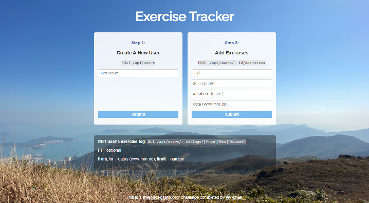

# [Exercise Tracker](https://www.freecodecamp.org/learn/apis-and-microservices/apis-and-microservices-projects/exercise-tracker)
freecodecamp.org project page:
https://www.freecodecamp.org/learn/back-end-development-and-apis/back-end-development-and-apis-projects/exercise-tracker

## Solution:
https://boilerplate-project-exercisetracker.wy-chan.repl.co
|  |
| ------- |

## Usage

- ### Create A New User

      POST /api/users
  
  Example Usage:

  > - **username**: abc

  Example Output:
  
      {
       "username":"abc",
       "_id":"626158808580bd00323d9a9d"
      }

- ### Add Exercises

      POST /api/users/:_id/exercises
  
  Example Usage:
  > - **:_id**: 626158808580bd00323d9a9d
  > - **description**: running
  > - **duration(mins.)**: 60
  > - **date(yyyy-mm-dd)**: 2020-04-20

  Example Output:
  
       {
        "username":"abc",
        "description":"running",
        "duration":60,
        "date":"Wed Apr 20 2022",
        "_id":"626158808580bd00323d9a9d"
       }
  
- ### Get a list of all users

      GET /api/users

  Example Usage:

      https://boilerplate-project-exercisetracker.wy-chan.repl.co/api/users

- ### Get the user object with a log array of all the exercises added

      GET /api/users/:_id/logs

  Example Usage:

      https://boilerplate-project-exercisetracker.wy-chan.repl.co/api/users/626158808580bd00323d9a9d/logs

  Example Output:
  
      {
        "_id":"626158808580bd00323d9a9d",
        "username":"abc",
        "log":[
              {"description":"running","duration":30,"date":"Sat Jan 01 2022"},
              {"description":"running","duration":30,"date":"Tue Feb 01 2022"},
              {"description":"running","duration":30,"date":"Tue Mar 01 2022"},
              {"description":"running","duration":60,"date":"Thu Apr 21 2022"}
              ],
        "count":5
      }

- ### Add ***from***, ***to*** and ***limit*** parameters to a GET /api/users/:_id/logs request

      GET /api/users/:_id/logs?[from][&to][&limit]

  Example Usage - ***from***:

      https://boilerplate-project-exercisetracker.wy-chan.repl.co/api/users/626158808580bd00323d9a9d/logs?&from=2022-02-02

  Example Output - ***from***:

      {"_id":"626158808580bd00323d9a9d",
      "username":"abc",
      "log":[
        {"description":"running","duration":30,"date":"Tue Mar 01 2022"},
        {"description":"running","duration":60,"date":"Thu Apr 21 2022"}
      ],
      "count":2}

  Example Usage - ***to***:
  
       https://boilerplate-project-exercisetracker.wy-chan.repl.co/api/users/626158808580bd00323d9a9d/logs?&to=2022-02-02

  Example Output - ***to***:

      {"_id":"626158808580bd00323d9a9d",
      "username":"abc",
      "log":[
          {"description":"running","duration":30,"date":"Sat Jan 01 2022"},
          {"description":"running","duration":30,"date":"Tue Feb 01 2022"
          }],
      "count":2
      }
  
  Example Usage - ***limit***:

      https://boilerplate-project-exercisetracker.wy-chan.repl.co/api/users/626158808580bd00323d9a9d/logs?limit=1

  Example Output - ***limit***:

        {
        "_id":"626158808580bd00323d9a9d",
        "username":"abc",
        "log":[{"description":"running","duration":30,"date":"Sat Jan 01 2022"}],
        "count":1
        }

  Example Usage - ***from, to & limit***:
        
        https://boilerplate-project-exercisetracker.wy-chan.repl.co/api/users/626158808580bd00323d9a9d/logs?limit=1&from=2022-02-02&to=2022-04-30

  Example Output - ***from, to & limit***:

      {
        "_id":"626158808580bd00323d9a9d",
        "username":"abc",
        "log":[{"description":"running","duration":30,"date":"Tue Mar 01 2022"}],
        "count":1
      }
  

## Tasks:
- [x] You can POST to /api/users with form data username to create a new user.

- [x] The returned response from POST /api/users with form data username will be an object with username and _id properties.

- [x] You can make a GET request to /api/users to get a list of all users.

- [x] The GET request to /api/users returns an array.

- [x] Each element in the array returned from GET /api/users is an object literal containing a user's username and _id.

- [x] You can POST to /api/users/:_id/exercises with form data description, duration, and optionally date. If no date is supplied, the current date will be used.

- [x] The response returned from POST /api/users/:_id/exercises will be the user object with the exercise fields added.

- [x] You can make a GET request to /api/users/:_id/logs to retrieve a full exercise log of any user.

- [x] A request to a user's log GET /api/users/:_id/logs returns a user object with a count property representing the number of exercises that belong to that user.

- [x] A GET request to /api/users/:id/logs will return the user object with a log array of all the exercises added.

- [x] Each item in the log array that is returned from GET /api/users/:id/logs is an object that should have a description, duration, and date properties.

- [x] The description property of any object in the log array that is returned from GET /api/users/:id/logs should be a string.

- [x] The duration property of any object in the log array that is returned from GET /api/users/:id/logs should be a number.

- [x] The date property of any object in the log array that is returned from GET /api/users/:id/logs should be a string.. Use the dateString format of the Date API.

- [x] You can add from, to and limit parameters to a GET /api/users/:_id/logs request to retrieve part of the log of any user. from and to are dates in yyyy-mm-dd format. limit is an integer of how many logs to send back.
